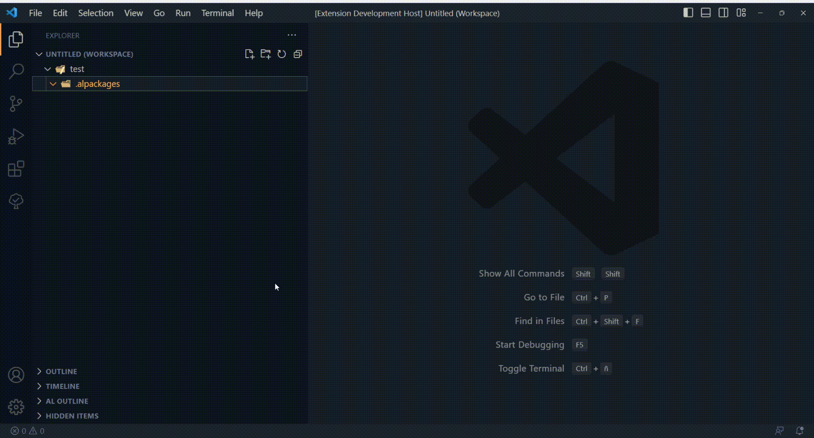

# AL Packages

AL Packages allows you to download symbols in 10 seconds of any Business Central version without having to connect to an online Sandbox or to an On-Premise environment.

It downloads symbols (Base Application.app, System Application.app, Application.app and System.app) from Microsoft official artifacts repository, so this extension is always up to date.

There are two commands:

1. AL: Download packages. This command allows you to download symbols specifying environment type and country.
2. AL: Download artifact versions. This command allows you to update the available Microsoft artifacts saved in your PC.

